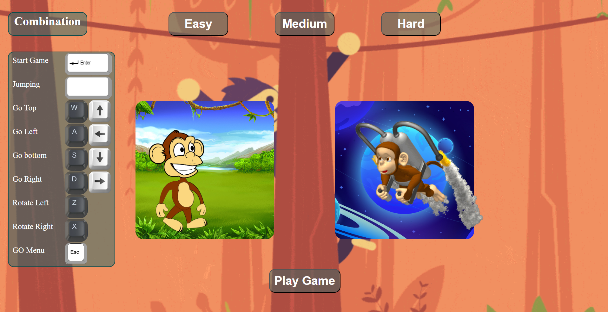

# Monkey Game / Игра Обезьяна

## Monkey Game Screenshot / Скриншот игры Обезьяна



## Описание / Description

**Monkey Game** - это простая и увлекательная игра, разработанная с использованием языка программирования JavaScript. В ней ваша задача - управлять обезьяной, собирая бананы и избегая препятствий. Присоединяйтесь к этой захватывающей игре и покажите свои навыки в управлении!

**Monkey Game** is a simple and addictive game developed using the JavaScript programming language. Your goal is to control the monkey, collect bananas, and avoid obstacles. Join this exciting game and showcase your skills in navigation!

## Особенности / Features

- Простой и интуитивно понятный геймплей.
- Различные уровни сложности для игры.
- Красочный и привлекательный дизайн.

- Simple and intuitive gameplay.
- Various levels of difficulty for gameplay.
- Colorful and appealing design.

## Управление / Controls

- Показано на начальной странице игры

- Shown on the game's home page

## Установка / Installation

Для начала игры просто склонируйте этот репозиторий на свой компьютер и откройте файл `index.html` в вашем любимом браузере.

To start playing the game, simply clone this repository to your computer and open the `index.html` file in your favorite web browser.

```bash
git clone https://github.com/MSGarnik/Monkey.git
cd Monkey
```
